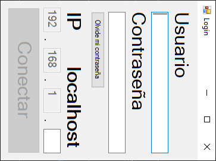

# Stock-y-Surtidos-App

## Ventanas

### Log-In

En esta ventana se especifica el usuario, contraseña e ip para ingresar a la base de datos principal, el programa abre primero esta ventana antes de abrir la ventana principal.

### Principal

En esta ventana hay botones para ir al listado de productos, de fuentes, de listas (si, una lista de listas).

### Lista Productos

En esta ventana se pueden listar, agregar, modificar y eliminar productos de cualquier fuente.
 

### Lista Fuentes

En esta ventana se pueden listar, agregar, modificar y eliminar fuentes.

## TO-DO: 

- Diseñar un icono para el programa
- Ventana de MANEJAR LISTAS que facilite detalles acerca de la lista de compras

### Productos

Un producto representa a un bien físico del mundo real y proveniente de un supermercado, local, tienda X.
Se puede ver, agregar, modificar y eliminar Productos.
 
### Fuentes

Una Fuente representa a un local/supermercado/sucursal en la que se pueden comprar bienes
Se puede ver, agregar, modificar y eliminar Fuentes

# Roadmap: 
- Surtido realizado (una lista de compras y una fecha)
- Boton para generar un Excel conteniendo: productos que tenemos bien en una columna, otra columna con productos que no tenemos o tenemos poco, una columna con los gastos de cada producto que nos recomienda comprar en los lugares donde sale mas barato, con una columna al lado que especifique de que lugar hay que comprarlo (agrupado por eso) y otra columna que haga lo mismo pero con los productos mas caros, entonces se consigue un presupuesto minimo y presupuesto maximo. Los productos caros obviamente se tienen que conseguir por la comparacion de productos de la misma categoria y no de distinta tienda, a parte de ser distintos productos obviamente

- Reescribir todo el proyecto y repositorio en Inglés

# Lista de cambios

## v0.3.2-dev

- Ya no se necesita tener creada la carpeta credentials antes de abrir el programa por primera vez

## v0.3.1-dev

- Ahora se puede elegir el nombre y contraseña para conectarse a la base de datos desde la laptop

## v0.3-dev

- Ahora se pueden agregar productos a una lista de compras temporal:
	- Se puede guardar esa lista temporal en el ordenador con nombre a eleccion (.csv).
	- La lista temporal persiste en el ordenador en el archivo lists/productlist.csv
	
- Bugs corregidos:
	- El programa modificaba el nombre del producto y lo dejaba en vacio si se cerraba o cancelaba el InputBox respectivo sin escribir nada.
	- El programa se crasheaba al cerrar el InputBox que aparece al querer modificar el precio de un producto.
	
